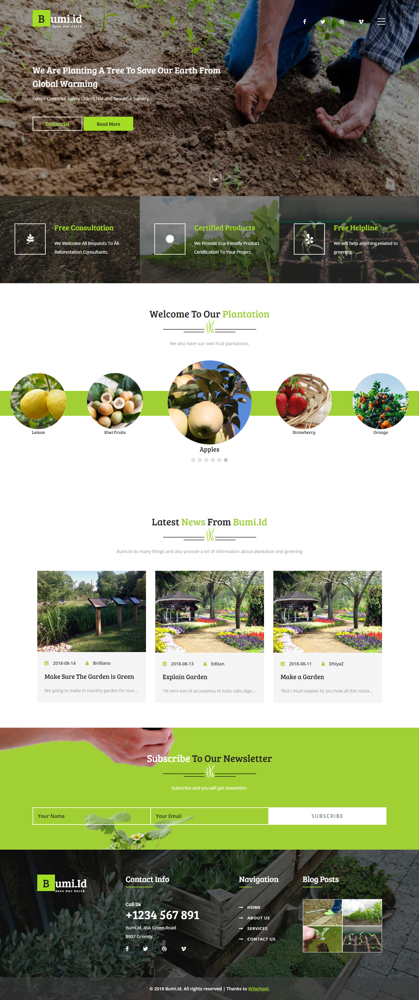
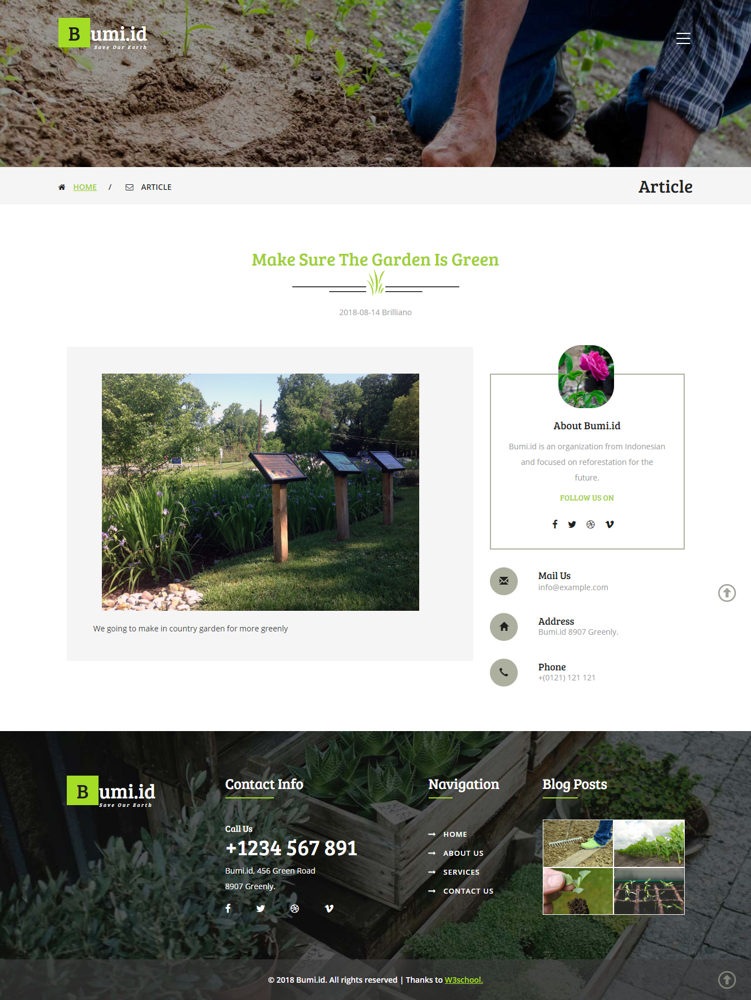
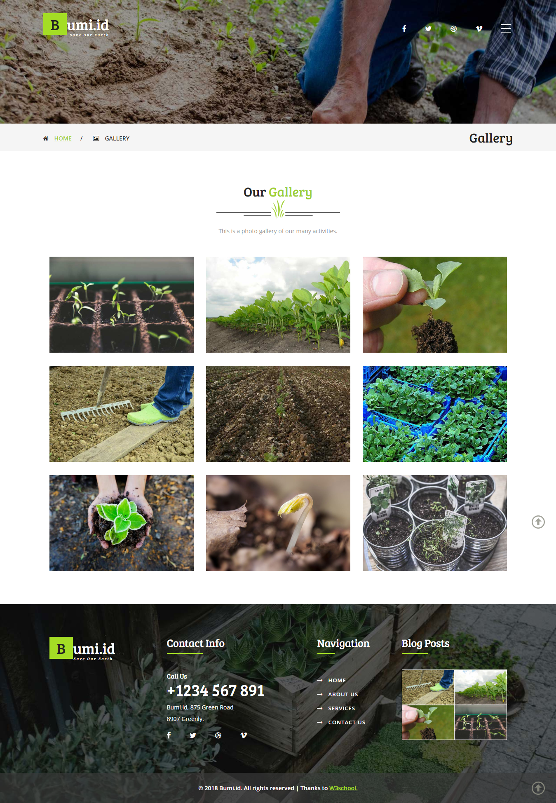
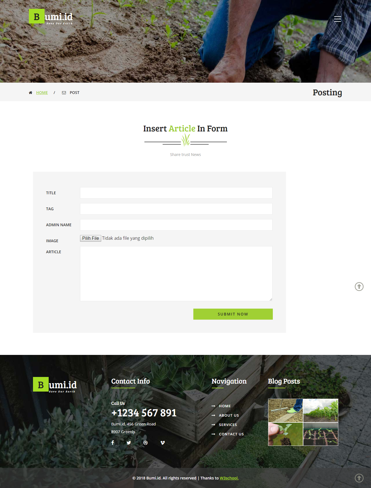

# Bumi id 🍃


> This web created by using PHP and MySQL
> This is my project when I was an intern at [PT. Delta Sinergi Prima](https://delta.id/)

## Features

* Circle Slider
* Gellery
* Read Article
* Add article
* About page

## Used Framework

* [Bootstrap](https://getbootstrap.com/)
* [Jquery](https://jquery.com/)

## To run this project locally

* Clone this repo
* Import this [bumi.sql](database/bumi.sql) to your Database
* Move this file to htdocs inside xampp folder
  ```diff
  ! if you're use local XAMPP
  ```
* Run [index.php](web/index.php) on your browser

## The idea behind this project

This project is created for my last project on [PT. Delta Sinergi Prima](https://delta.id/). Before this the Director have project to me for make template website for his client, that's why this project name and theme is Bumi

## Screenshot

<kbd>

</kbd>

<kbd>

</kbd>

<kbd>

</kbd>

<kbd>

</kbd>